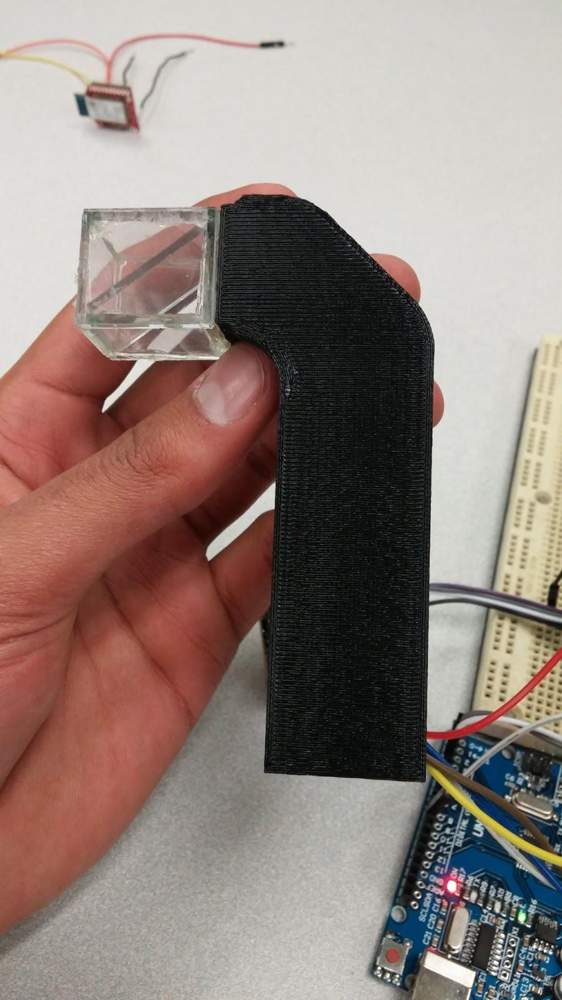

# ARGlass

Simple augmneted reality glasses to watch your favorite football game's progress without having to be in front of a TV. 

## Requirements 
### Hardware 
Arduino microcontroller 
RN-42 Bluetooth Module 
Micro-OLED Screen 

### Software 
+ Python 3.5 or higher 
+ Python Tesseract ( pip3 install pytesseract )
+ Tesseract-ocr ( sudo apt install tesseract-ocr )
+ Ubuntu or other Linux based operating system 

## Demo

  
  

