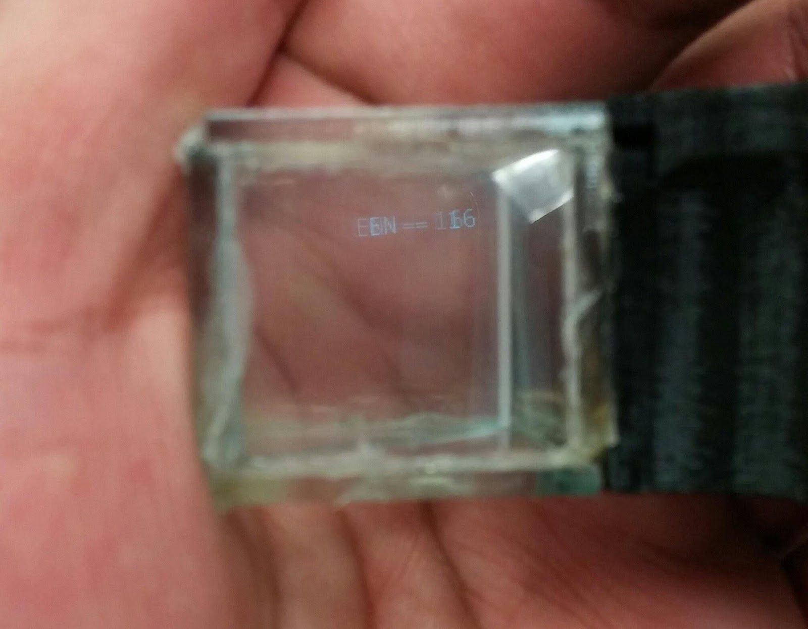

# ARGlass
Simple augmented reality glasses to watch your favorite football game's progress without having to be in front of a TV. 

The server program processes the sport video frame-by-frame, while looking for the team names and their current score.  When a team scores, the program sends data about the game to the glasses and the viewer will see the results reflected on the glass prism. 

## Requirements 
### Hardware 
+ Arduino microcontroller 
+ RN-42 Bluetooth Module 
+ Micro-OLED Screen 

### Software 
+ Python 3.5 or higher 
+ Python Tesseract ( pip3 install pytesseract )
+ Tesseract-ocr ( sudo apt install tesseract-ocr )
+ Ubuntu or other Linux based operating system 

## Demo

  

